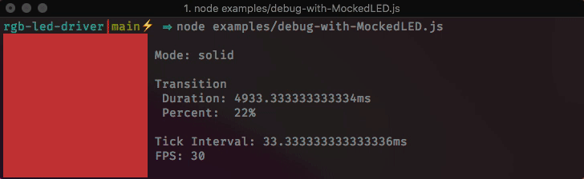

<div align="center">
    
    <h1>rgb-led-driver</i></h1>
    <p>
        A flexible, JavaScript-based RGB LED driver featuring many RGB color modes (rainbow, transitions, ...)
    </p>
    <p>
        <a href="docs/api.md">API</a>
        <span>&nbsp;|&nbsp;</span>
        <a href="#examples">Examples</a>
    </p>
</div>

## Features
- Mode-based RGB color engine
- Automatic transitions between modes
- Bluetooth Low Energy support via `gatttool`
- Easy to create new modes
- Flexible: create your own backends (LED connectors)

## Overview

- [Usage](#usage)
    - [Installation](#installation)
    - [Setup a driver and use a LED backend](#setup-a-driver-and-use-a-led-backend)
    - [Controlling the LEDs](#controlling-the-leds)
    - [Transitions](#transitions)
- [Examples](#examples)
- [Color modes](#modes)
    - [Built-in modes](#built-in-modes)
    - [Custom modes](#custom-modes)
- [Backends](#backends)
    - [Built-in backends](#built-in-backends)
    - [Custom LED backends](#custom-led-backends)
- [Changelog](#changelog)

## Usage
### Installation
```shell
npm install rgb-led-driver
```

### Setup a driver and use a LED backend
```js
const { RGBLEDDriver, GATTLED, MockedLED } = require('rgb-led-driver');
const { MyCustomLED } = require('./my-custom-led');

// These options are optional but can be passed to RGBLEDDriver
const options = {
    /**
     * Tick interval in ms, default is 33ms for ~30fps
     * @optional
     * @type {Number}
     */
    tickSpeed: 33,

    /**
     * Callback is invoked when the tick fn of the LED is returning errors
     * @optional
     * @type {Function}
     */
    tickErrorHandler: () => {...},
    
    /**
     * List of available LED modes.
     * See src/modes to see how they work.
     *
     * @optional
     * @type {Array}
     */
    modes: [...], // 
};


// Create a new driver instance
let rgb = new RGBLEDDriver(options);

// Another optional way to set the tickErrorHandler
rgb.onTickError((e) => console.error('TICK:ERROR', e));


/*
 * Setting an LED backend
 *
 * This LED backend is what receives RGB colors and is responsible
 * for "displaying them".
 *
 * This could be 
 *   - setting a color on a screen (e.g. MockedLED)
 *   - sending a color via Bluetooth (e.g. GATTLED)
 *   - anything where you want to set a color
 *
 * See the "LEDs" section for more info.
 */

// In this case I want to connect
rgb.setLED(new GATTLED('72:16:03:00:D4:61'));
// or
rgb.setLED(new MockedLED(rgb));
// or
rgb.setLED(new MyCustomLED(...));


// The driver is now ready and the loop is running and can be used
// ...
```

### Controlling the LEDs
```js
// Set a mode (e.g. rainbow, random, solid)
rgb.setMode('rainbow');

// Set mode to solid color
rgb.setMode('solid');

// Change color of solid mode
// Function arguments for setColor are directly passed to chroma-js to create a color,
// so see https://gka.github.io/chroma.js for more info on this.
rgb.currentMode.setColor(r, g, b, 'rgb');

// setMode returns the new mode so this can be chained
rgb.setMode('rainbow')
   .setSpeed(1.5); // speed is hue rotations per second
````

### Transitions
We can transition between colors by setting a "transition override". This will generate an array of colors between a "from" and "to" color.

The tick method will then stop being called until the colors in this array have all been shown. A duration for this fade can be passed as well (in ms).

```js
// Get the old color, this is the "from"
const previousColor = rgb.currentMode.color;

// Set the mode before transitioning
rgb.setMode('solid')
   .setColor(0, 0, 255, 'rgb');

// The new color is to "to"
const newColor = rgb.currentMode.color;

// Transition from previous to new in 700ms
rgb.setTransitionOverride(previousColor, newColor, 700);
```

---

## Examples
- [Custom Backend LED](examples/custom-backend-led.js)
- [Developing with MockedLED](examples/debug-with-mockedled.js)


---

## Color modes
> Color modes are the part of the driver, that get called ~30 times per second (unless specified) and are the part that actually handles colors. The active mode's `tick` function gets called with a delta time and sets the `color` property to RGB values for the desired color.

For example the rainbow mode cycles through the 360 degree hue value by adding a set amount to it that is multiplied by the delta.

This has the effect that the color effect is bound by time and not by the amount of times the function gets called. This is a [concept taken from game development](https://dev.to/dsaghliani/understanding-delta-time-in-games-3olf) and makes creating modes super easy.

### Built-in modes
The following modes are available out-of-the-box:
- [`solid`](src/modes/SolidColorMode.js): Shows a solid color. **Use this mode for setting static colors.**
- [`blackout`](src/modes/BlackoutMode.js): Just renders black
- [`notification`](src/modes/NotificationMode.js): Flashes a color
- [`rainbow`](src/modes/RainbowMode.js): Cycles though the hue space, creating a rainbow effect
- [`random`](src/modes/RandomMode.js): Sets a random color every second

All these modes subclass [`RGBMode`](src/modes/RGBMode.js) which you can also use to implement custom modes.

### Custom modes
You can create custom LED backends by extending [`RGBMode`](src/modes/RGBMode.js):
For easier color manipulation, every RGBMode has an instance of [chroma-js](https://gka.github.io/chroma.js) attached.

For example, this is how [`random`](src/modes/RandomMode.js) is implemented:
```js
const { RGBMode } = require('rgb-led-driver');

class MyCustomMode extends RGBMode {
    constructor() {
        super();

        this.type = 'my-custom-mode';
        // Every mode has an instance of chroma-js for easy color manipulation
        this.color = this.chroma('red').rgb();
        this.counter = 0.0;
        this.speed = 1000.0;
    }

    /**
     * Set speed in per seconds
     * @param {number} speed Num of colors per second (1 = 1 per second)
     */
    setSpeed(speed) {
        this.speed = speed * 1000;

        return this;
    }

    tick(delta) {
        this.counter += this.speed * (delta / 1000);
        if (this.counter >= 1000) {
            this.counter = 0.0;
            this.color = this.chroma.random().rgb();
        }
    }
}
```

Your mode can then be used like this:
```js
const { RGBLEDDriver, defaultModes } = require('rgb-led-driver');
const { MyCustomMode } = require('./MyCustomMode');

const rgb = new RGBLEDDriver({
    modes: [
        // Include the built-in modes as well
        ...defaultModes(),
        'my-custom-mode': new MyCustomMode()
    ]
});

// ...

rgb.setMode('my-custom-mode')
   .setSpeed(2);
```

For more info on how modes work and how to use them, have a look at [src/modes/index.js](src/modes/index.js).

---

## Backends
> Backends are the part of the driver that take the generated RGB values and send them to where they are needed. This may be sending them to a Bluetooth LED, sending them to some server or rendering them on a screen. Options are endless here.

Backends are what receives RGB colors and is responsible for "displaying them".

This could be:
- setting a color on a screen (e.g. MockedLED)
- sending a color via Bluetooth (e.g. GATTLED)
- basically anything where you want to set a color

### Built-in backends
There are 2 built-in backends.

- [`GATTLED`](src/leds/GATTLED.js): A Bluetooth Low Energy LED driver using `gatttool` internally (supports the qhm-d461 chipset).

    _Usage_:
    ```js
    const { RGBLEDDriver, GATTLED } = require('rgb-led-driver');
    
    // Create an LED and connect to a MAC address via BLE
    const led = new GATTLED('72:16:03:00:D4:61');
    
    const rgb = new RGBLEDDriver(options);
    rgb.setLED(led);
    ```

    > **Programmers Warning**: The BLE implementation in this driver is kinda whack if I'm honest. 
    > I'm just piping a Node child process running [`gatttool`](https://elinux.org/RPi_Bluetooth_LE) and feeding it text commands to change colors.
    > However it runs stable enough to use for home automation. 
    > If you want to support a backend like [@abandonware/noble](https://github.com/abandonware/noble#readme), 
    > the color effects and modes still work if you write your own wrapper class for it.
    > The reason I'm doing it this way is simply _because I could't get any other solution to work_ ¯\\\_(ツ)\_/¯


- [`MockedLED`](src/leds/MockedLED.js): An LED driver that renders the current color to the terminal screen. Very useful for creating and debugging new RGBModes.

    _Usage_:
    ```js
    const { RGBLEDDriver, MockedLED } = require('rgb-led-driver');
    
    const rgb = new RGBLEDDriver(options);

    // Note: the LED needs a reference to the driver to work!
    const led = new MockedLED(rgb);
    
    rgb.setLED(led);
    ```

### Custom LED backends

You can create custom LED backends by extending [`BaseLED`](src/leds/BaseLED.js):
```js
const { BaseLED } = require('rgb-led-driver');

class MyCustomLED extends BaseLED {
    constructor(ip) {
        super();

        this.socket = createSocket(ip, ...);
    }

    /**
     * Called every tick if the color has changed.
     * RGB values are 0-255.
     * @param {number} red   
     * @param {number} green 
     * @param {number} blue  
     */
    setRGB(r, g, b) {
        this.socket.send([r, g, b]);
    }

    /**
     * Called when driver is shutdown.
     * Use this for cleanup!
     */
    destroy() {
        this.socket.destroy();
    }
}
```

Your custom LED driver can then be used like this:
```js
rgb.setLED(new MyCustomLED('192.168.0.1'));
```

---

## Changelog
### 1.0.5
- **Fixed:** `gatttool` gets killed on shutdown, no more dangling processes

### 1.0.4
- **Added** docs, also on NPM directly

### 1.0.2
- **Fixed** RGB driver not stopping backend properly

### 1.0.1
- **Fixed** backends not being exported properly

### 1.0.0
- Stable release
- **Added** documentation
- **Changed** to use subclassing for custom functionality

### 0.0.13
- Changed tick error handling to allow custom handler using `rgb.onTickError()`